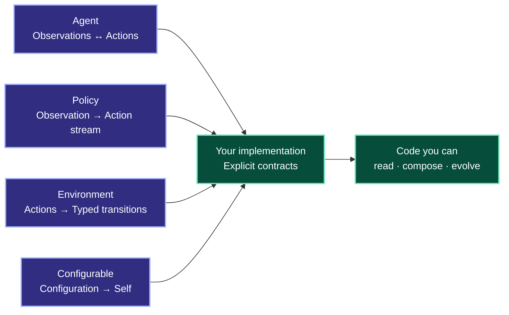

<!-- markdownlint-disable -->

<div align="center">

<br />

<p><strong>GOOD PATTERNS DESERVE BEAUTIFUL TYPES.</strong></p>

<h1>🧩 composables</h1>

<p><strong>Familiar patterns. Beautiful types. Better code.</strong></p>

<p>
The patterns you reach for every day, expressed through precise Python types.<br />
Turn familiar ideas into clear contracts and code worth building on.
</p>

<p><strong>Zero runtime dependencies.</strong> Built entirely on the Python standard library.</p>

<p>
  <a href="packages/composables/pyproject.toml"></a>
  <a href="packages/composables/pyproject.toml"></a>
  <a href="packages/composables/composables/py.typed"></a>
  <a href="LICENSE"></a>
  <a href="https://github.com/betarixm/composables/issues"></a>
</p>

<p>
  <a href="packages/composables/README.md"><strong>Explore the notions →</strong></a>
  &nbsp; · &nbsp;
  <a href="https://github.com/betarixm/composables/issues"><strong>Shape what comes next ↗</strong></a>
  &nbsp; · &nbsp;
  <a href="https://github.com/betarixm/composables/releases"><strong>Follow releases</strong></a>
</p>

<br />

</div>

---

## Your best patterns deserve better types.

Configuration factories. Action streams. Interactive agents. Stateful sessions. You reach for these patterns whenever you build something new.

**composables** gives them names and beautiful type definitions. We call them **notions**: recurring patterns expressed as small, precise contracts. Use them to make intent easier to read, implementations easier to compose, and changes easier to check.

The current package contains abstract base classes and domain types. You bring the behavior; the notions give your code a shared vocabulary.

<table>
<tr>
<td width="33%" valign="top">
<h3>🧩 Name the pattern</h3>
<p>Give recurring ideas a recognizable shape. Agents, policies, environments, and configuration factories become concepts your code can speak.</p>
</td>
<td width="33%" valign="top">
<h3>⇄ Let the types explain</h3>
<p>Generic parameters make inputs, outputs, and relationships explicit. See what a component accepts and produces before reading its implementation.</p>
</td>
<td width="33%" valign="top">
<h3>⌁ Raise the quality</h3>
<p>Implement against shared contracts. Help readers follow intent, type checkers catch mismatches, and future changes preserve the boundaries you chose.</p>
</td>
</tr>
</table>

## A small vocabulary. More expressive code.

Choose the notion that fits your pattern. Give its type parameters meaning in your domain.



The types describe what goes in, what comes out, and how the pieces relate. Each notion also defines its behavioral contract, including execution state ownership and session lifetimes where relevant.

**Choose your pieces:** [Agent](packages/composables/composables/agent/protocols.py) · [Policy](packages/composables/composables/policy/protocols.py) · [Environment & sessions](packages/composables/composables/environment/protocols.py) · [Configurable](packages/composables/composables/configurable/protocols.py)

[Find your next notion in the catalog →](packages/composables/README.md)

## Get close to the code.

Use Python 3.12+ and the `uv` version pinned in [pyproject.toml](pyproject.toml).

```bash
git clone https://github.com/betarixm/composables.git
cd composables
uv sync --locked
```

Open the [catalog](packages/composables/README.md), recognize a pattern you use, and bring its type contract into your code.

<details>
<summary><strong>Working on the notions? Run the checks.</strong></summary>

```bash
uv run ruff format --check .
uv run ruff check .
uv run pyright
uv run pytest
uv build --package composables --no-sources
```

</details>

---

<div align="center">

<h2>You're early. Help define the vocabulary.</h2>

<p>
The API is still taking shape. Your use case can help define what comes next.<br />
Bring a pattern you keep writing. Help give it the type definition it deserves.
</p>

<p>
<strong>Star the repository to follow along. Open an issue to help steer it.</strong>
</p>

<p>
  <a href="https://github.com/betarixm/composables"><strong>☆ Follow the project</strong></a>
  &nbsp; · &nbsp;
  <a href="https://github.com/betarixm/composables/issues"><strong>Bring your use case →</strong></a>
</p>

<sub>Composable primitives for Python · <a href="LICENSE">MIT licensed</a></sub>

<br />

</div>
